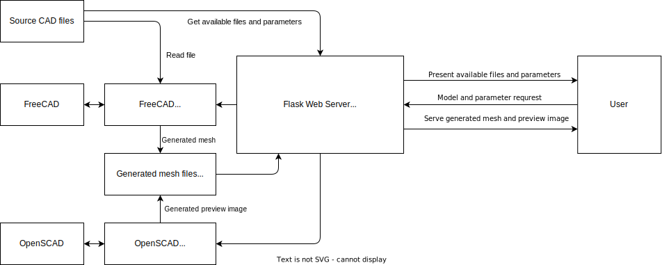

[](https://opensource.org/licenses/MIT)
[](https://github.com/psf/black)

[](https://github.com/suhren/paramodel/actions/workflows/format.yml)
[](https://github.com/suhren/paramodel/actions/workflows/lint.yml)
[](https://github.com/suhren/paramodel/actions/workflows/test.yml)

# paramodel

This repository allows users to generate customized STL files from source FreeCAD files without ever having to open the CAD software itself. This is accomplished by implementing a Python CLI that wraps the FreeCAD library allowing for parametrization of dimensions within the CAD file, and export to mesh files. Building on top of this, it also provides a simple web server with a RESTful API that can interface with the CLI to allow online web users to select models, customize them with parametrization, and then download the generated mesh files.

## Setup

Before running the model generator service, make sure to create and place your FreeCAD `.FCStd` files in the directory `app/assets`.

### Docker

First, make sure you have [Docker](https://www.docker.com/) installed on your system. Then, to run the model generator service as a docker container, run the following:

```bash
docker build -t paramodel .
docker run -dp 80:80 paramodel
# View the running containers and logs
docker container ls -a
docker logs -f <container_id>
```

Then navigate to `127.0.0.1` or `localhost` in your browser to access the model generator interface.

### Running locally (Windows and Linux)

First, make sure you have the following required software installed on your system:

- The [FreeCAD](https://www.freecad.org) software
- The [OpenSCAD](https://openscad.org) software
- A Python installer like [Miniconda](https://docs.conda.io/en/latest/miniconda.html)

Then create a new python environment, install the required packages, and run the service:

```bash
conda create -n paramodel python=3.8
conda activate paramodel
pip install -r requirements.txt
python -m app.model_generator_service
```

## Background

### What is parametric design?

When creating CAD models it is useful to do so using **parametric design**, where attributes like dimensions of the model can be modified by tweaking a few parameters, and then have the model re-compute itself automatically. As the name implies, all parametric CAD software works this way, but differ somewhat in the way these parameters are exposed to the user to modify. The first and most primitive way of doing this, is by having the user open the CAD model file itself, going through the sketches in the model-tree defining the shape, and finding the dimensions that have to be tweaked. The second, easier way also requires the user to open the CAD file, but instead lets them edit the needed parameters more continently in a spreadsheet-like interface where all the important dimensions are defined in one tabular place.

### What did I want to accomplish?

I regularly create such parametric designs used for 3D printing specifically, which I then share with others online so that they can print the models themselves. However, oftentimes there is no "one size fits all" when it comes to dimensioning such models, and some amount of ability to customize them is required.

When a mesh files is generated from a source CAD file, it is no longer possible to modify using parametrization. Therefore, to allow others to customize the model before generating the mesh file, we need to provide them the source CAD file as well. For software like FreeCAD, this is easy enough, as I can simply provide the source `.FCStd` file and ask the user to set parameters in the file, and then generate the mesh themselves. However, this requires that the user has the CAD software installed, and knows how to modify the parameters within.

I'd like to provide a more convenient way of generating such customized mesh files, without the user ever having to open the CAD software itself.

### Choice of technologies

The main requirements I considered when creating this system were the following:

- An entirely Free and Open Source tech stack
- An easy API and CLI that allows for parametrization and generation of meshes from CAD files written in my language of choice (Python)
- A system allowing users with no knowledge or access to CAD software to generate parametrized models for 3D printing (STL mesh files) from an online interface

Initially, I was considering the [OpenSCAD](https://openscad.org/) software as the backbone of the system. It is a CAD software where you "program" your models with code, and has a powerful CLI and Python API that enables easy integration with this system. However, even though I am a programmer myself, I found it to be too much effort to get nice looking and functional 3D models going in the software by merely "coding" their shape. Going with OpenSCAD would set the bar really high for anyone wanting to use this system, which is another aspect I was also considering.

The next CAD software I looked at was [FreeCAD](https://www.freecad.org/). This has a conventional GUI where you create models using a conventional approach without having to do any programming. I found that this enabled me to produce many more models in a shorter time compared to OpenSCAD. In addition, this also has Python API bindings that makes it easy to integrate into this system. Since it checked all requirements, I decided to go with this.

## Systems Overview

Below is a overview diagram showing how the different components of the system interface with each other.


## Future Improvements

The aim of this project was to provide a minimum set of functionalities to allow users to generate customizable mesh files from an online interface. While this was accomplished, there are further improvements that I think should be considered:

- Allow the generator service to reuse already generated model files for parameter combinations by using the hash of the parameter combination
- FreeCAD is pretty slow at generating certain files, for example when there is a large number of polar pattern occurrences. Can this be sped up?
- The current setup assumes that all users of the web service are "reasonable" actors. There is no rate limit of how many models, or how often a single user can requrest a mesh to be generated
- The web service currently only shows a preview of the model with a small image render from OpenSCAD from the mesh file. Can this be improved with something like a full 3D model viewer in the browser that can show STL files?  
